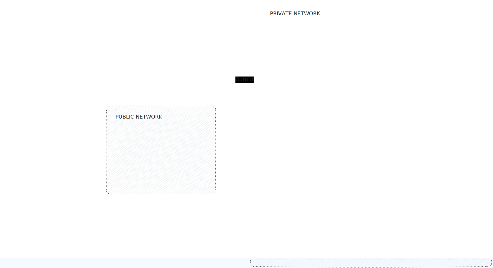

# Gluns-Spring

Service built to work as core microservice for Gluns-Bank project.


## Index
- [Useful Links](#useful-links)
  - [Project Resources](#project-resources)
- [Brief Features Description](#brief-features-description)
- [Use](#use)
  - [Local](#local)
  - [Docker](#docker)
- [Tech stack](#tech-stack)
  - [CI/CD](#cicd)
  - [DB](#db)
- [Architecture](#architecture)
- [Infrastructure](#infrastructure)
- [Configuration](#configuration)
  - [Keycloak Configuration](#keycloak-configuration)
- [Flows](#flows)

## Useful Links

- Frontend: https://github.com/Kolman-Freecss/gluns-front
- Python Backend: https://github.com/shubhamsugara22/gluns-python-backend

### Project Resources
- Swagger: http://localhost:8083/webjars/swagger-ui/index.html#/
- Keycloak: http://localhost:8080/
- Database Client (pgAdmin4): http://localhost:80/
- MySQL: http://localhost:3306/

## Brief Features Description

- Security implementation using Spring Boot 3.3.5 and Keycloak with JSON Web Tokens (JWT).
  - SSO (Single Sign-On) using Keycloak.
  - OAuth2 Protocol. 

## Use

### Local

1. Check the `.launchers` folder to see the different launchers.
2. Run GlunsSpringApplication.run.xml to start the application. (This will start the Springboot application)

## Docker

1. Build the Docker containers:

   ```bash
   docker compose build
   ```
   
2. Bring up the containers in the background:

   ```bash
    docker compose up -d
    ```
   
## Tech stack

- Java 21
- Spring:
  - Spring Boot 3.3.5
  - Spring Actuator
  - Spring Webflux
    - Reactive programming. Async API to perform non-blocking operations in the main thread application.
    - Used also to consume the Github API asynchrously (instead Java 11 HttpClient or OkHttp).
  - Spring Boot DevTools
    - To reload the application when a change is detected.
  - Spring AOP
    - Auxiliar Join Components to log the requests and responses.
- Auth:
  - Keycloak
  - JSON Web Tokens (JWT)
- Maven
- OpenAPI/Swagger docs v2

### CI/CD

- Docker
- Docker Compose

### DB

- MySQL
- pgAdmin4
- Spring Data JPA Hibernate
  - Way to interact with the database using an ORM (Hibernate) with all the entities and relationships configured.

## Architecture

- Microservices Architecture
  - Sync communication through REST API
- Hexagonal Architecture

## Infrastructure

Diagram Flow:


## Configuration

### Keycloak Configuration

- Configure Keycloak with the following settings:
  - New Realm: `gluns`
  - Create a new Client: `gluns-back`
    - Client ID: `gluns-back`
  - 2 Roles: `USER` and `ADMIN`
  - 2 Users: `user` and `admin`
    - Password: `password`
    - Map Roles to the users: `USER` and `ADMIN`


## Flows

User Chat Flow:



---

Shield: [![CC-BY-NC-ND 4.0][CC-BY-NC-ND-shield]][CC-BY-NC-ND]

This work is licensed under a [Creative Commons Attribution-NonCommercial-NoDerivatives 4.0 International License.][CC-BY-NC-ND]

[![CC-BY-NC-ND 4.0][CC-BY-NC-ND-image]][CC-BY-NC-ND]

[CC-BY-NC-ND-shield]: https://img.shields.io/badge/License-CC--BY--NC--ND--4.0-lightgrey
[CC-BY-NC-ND]: http://creativecommons.org/licenses/by-nc-nd/4.0/
[CC-BY-NC-ND-image]: https://i.creativecommons.org/l/by-nc-nd/4.0/88x31.png
